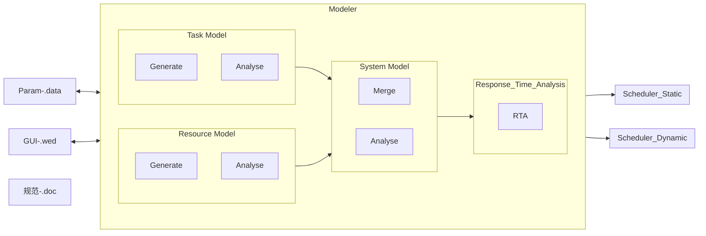

# TG-Project

## 1. 项目结构



### Data Output
  (1) DAG Fig;
  
  (2) Gantt Fig;
  
  (3) Schedule Tab;

# Technical_Case

基于遗传算法的优化框架，搜索最优的优先级(P)、偏移量(O)和核分配(A)

## 优化框架指令

```bash
python3 Opt_Frame.py \
    -i 50 \
    -p 128 \
    -d /home/fyj/Project/TG-RT-System/DAG_Model/Data/Idata/Task_New/Dag_0.json \
    -a /home/fyj/Project/TG-RT-System/DAG_Model/Data/Idata/System/Arch_Hete.json \
    -do /home/fyj/Project/TG-RT-System/DAG_Model/Data/Idata/Task_Opt/Dag_0_Arch_Hete_Opt.json \
    -fo /home/fyj/Project/TG-RT-System/DAG_Model/Data/Odata/Exam/Dag_0_Arch_Hete_Opt.csv
```

## 动态测试指令：

```bash
python3 Experiment.py \
    -e 1000 \
    -a /home/fyj/Project/TG-RT-System/DAG_Model/Data/Idata/System/Arch_Hete.json \
    -rd /home/fyj/Project/TG-RT-System/DAG_Model/Data/Idata/Task_New/Dag_0.json \
    -pd /home/fyj/Project/TG-RT-System/DAG_Model/Data/Idata/Task_Opt/Dag_0_Arch_Hete_Opt.json \
    -id /home/fyj/Project/TG-RT-System/DAG_Model/Data/Odata/Exam/Dag_0_Arch_Hete_Opt.csv \
    -od /home/fyj/Project/TG-RT-System/DAG_Model/Data/Odata/Exam/Dag_0_Arch_Hete_Opt.png
```

优先级计算工具共有py三个文件，其中：
（1）DAG_Priority_Config.py文件：提供DAG结构感知算法接口；

（2）limited_priority_assign.py文件：提供有限优先级算法接口；

（3）main.py文件：数据的输入输出平台接口函数及测试用例；
        文件输入接口函数：HaiSi_Data_Input(address)
                参数1——address：为输入数据文件的地址；
        文件输出接口函数：HaiSi_Data_Output(dag_list, address)
                参数1——dag_list：为DAG对象列表；
                参数2——address：为输出数据文件的地址；
        基于DAG结构感知的优先级计算接口函数：Priority_Config(Prio_type, dag_list)
                参数1——Prio_type：为优先级计算方法，基于DAG结构感知的优先级计算方法默认为 ’SELF'；
                参数2——dag_list：为DAG对象列表；
        有限优先级计算接口函数：Priority_Press_config(dag, prio_num)
                参数1——dag：需要计算有限优先级的DAG对象；
                参数2——prio_num：有限优先级算法的优先级数量；

注意：有限优先级的计算结果和基于DAG结构感知的优先级的计算结果用的是同一个变量保存，因此两个算法不可同时使用，后使用的算法的优先级结果会覆盖先使用的算法的优先级结果。

主函数（main）配置参数：
    press       # 是否采用有限优先级；
    queue       # 是否入队顺序，根据QoS在输出excel中对job进行重新排列；
    prio_num    # 如press为True，prio_num为配置的优先级数量，若press为False则prio_num参数无效

————————————————————————————
操作说明：
（1）方法2：（全优先级-无入队排序）
    press = False
    queue = False
    prio_num = 0    # 无需配置
（2）方法3：（全优先级-有入队排序）
    press = False
    queue = True
    prio_num = 0    # 无需配置
（3）方法4-1：（有限优先级-无入队排序）
    press = True
    queue = False
    prio_num = 3
（4）方法4-2：（有限优先级-有入队排序）
    press = True
    queue = True
    prio_num = 3
————————————————————————————
input_data.xlsx文件：输入数据文件；
        sheet 1（DAG_Instance）：DAG实例的相关输出参数。
        sheet 2（DAG_Type）：DAG的各job的相关输入参数。
output_data.xlsx文件：输出数据文件；

# DAG仿真平台

本工程代码为一套针对DAG的仿真平台，包括以下功能：

## 1.DAG数据输入

如Main.py文件中line22-23的代码所示：

```python
DAG_addr_list = [f'.\\Data\\data_input\\custom_sample_input{data_num}.xlsx' for data_num in range(100)]
Intpu_DAG_list = DDI.Manual_Input('HAISI', DAG_addr_list)
```

利用DAG_Configurator模块中的DAG_Data_Input文件的Manual_Input函数输入excel格式的DAG；

- **参数1——** 'HAISI'：表示要处理的数据格式（默认'HAISI'）；
- **参数2——** DAG_addr_list：表示要输入的excel文件的路径列表（list格式）；

## 2.DAG数据初始化

DAG数据初始化的函数My_Process如Main.py文件中line26-27的代码所示：

```python
with Pool(processes=cpu_count()) as pool:
    All_DAG_list = pool.map(My_Process, [{"DAG_id": DAG_id, 'DAG_x': DAG_x} for DAG_id, DAG_x in enumerate(Intput_DAG_list)])
```

为节省时间，程序启动多进程进行了并行加速处理。函数My_Process的功能包括

### 2.1 DAG参数初始化 (dag_data_initial)：

包括DAG的ID,Type符号等形式参数的初始化；

```python
def dag_data_initial(DAG_obj, DAG_id, DAGType, Period, Cycle=1, DAGInstID=0, Critic=1, Arrive_time=0)
```

函数参数介绍：

- **参数1——** DAG_obj：DAG的拓扑结构(DirGraph格式)；
- **参数2——** DAG_id：DAG的ID号；
- **参数3——** DAGType：DAG的类型符号；
- **参数4——** Period：DAG的执行周期；
- **参数5——** Cycle：DAG的循环次数，默认为1，即执行一次循环；
- **参数6——** DAGInstID：DAG的实例ID号，默认为0；
- **参数7——** Critic：DAG的关键性，高关键任务为1，低关键任务为2，默认为1；
- **参数8——** Arrive_time：DAG的到达时间，默认为0；

### 2.2 DAG的拓扑结构参数计算

计算DAG_obj的拓扑结构相关的DAG特性参数；

```python
def dag_topology_initial(DAG_obj)
```

具体的特性参数包括：

- (1) **shape**：DAG中各层结点数量的有序列表;此外还包括：

  - Ave_Shape：DAG中每层结点数量的平均值；
  - Std_Shape：DAG中每层结点数量的标准差；
  - Max_Shape：DAG中各层中最大的结点数量；
  - Min_Shape：DAG中各层中最小的结点数量；
  - Number_Of_Level：DAG的层数，即DAG的长度（length）；
- (2) **re-shape**：与shape相对应，逆向DAG（所有边的方向反转）中各层结点数量的有序列表;此外还包括：

  - Ave_Re_Shape：逆向DAG中每层结点数量的平均值；
  - Std_Re_Shape：逆向DAG中每层结点数量的标准差；
  - Max_Re_Shape：逆向DAG中各层中最大的结点数量；
  - Min_Re_Shape：逆向DAG中各层中最小的结点数量；
- (3) **anti-chain**：DAG的最大反链，即DAG的宽度（width）；
- (4) **degree**：DAG中各结点的度数：

  - DAG的度（Degree），即与结点邻接的结点/边的数量：
    - Max_Degree：DAG中最大的结点的度数；
    - Min_Degree：DAG中最小的结点的度数；
    - Ave_Degree：DAG中结点度数的平均值；
    - Std_Degree：DAG中结点度数的标准差；
  - DAG的入度（In-Degree），即结点的前驱结点数量：
    - Max_In_Degree：DAG中最大的结点的入度数；
    - Min_In_Degree：DAG中最小的结点的入度数；
    - Ave_In_Degree：DAG中结点入度数量的平均值；
    - Std_In_Degree：DAG中结点入度数量的标准差；
  - DAG的出度（Out-Degree），即结点的后继结点数量：
    - Max_Out_Degree：DAG中最大的结点的出度数；
    - Min_Out_Degree：DAG中最小的结点的出度数；
    - Ave_Out_Degree：DAG中结点出度数量的平均值；
    - Std_Out_Degree：DAG中结点出度数量的标准差；
- (5) **density**：DAG的稠密度，即连通比（Connection_Rate）；
- (6) **jump level**：DAG的最大条层，即DAG中边连接的结点之间的层数差的最大值；

### 2.3 DAG的颗粒度参数计算

计算DAG_obj的结点颗粒度大小相关的DAG特性参数（与WCET相关的特性参数）；

```python
def dag_graine_initial(DAG_obj):
```

具体的特性参数包括：

- DAG的颗粒度特性参数：
  - Med_WCET：DAG中各结点WCET的中位数；
  - Ptp_WCET：DAG中各结点WCET的极差；
  - Var_WCET：DAG中各结点WCET的方差；
  - Std_WCET：DAG中各结点WCET的标准差；
  - Ave_WCET：DAG中各结点WCET的平均值；
  - Max_WCET：DAG中各结点WCET的最大值；
  - Min_WCET：DAG中各结点WCET的最小值；
  - DAG_volume：DAG中所有结点WCET的总和；
  - Cri_volume：DAG中关键路径结点WCET的总和；
  - Cri_vol_rate：关键路径结点总和在DAG中所有结点总和的比值，即关键路径在全DAG中的占比；
- **l**：本结点所在DAG中路径的最大长度；
- **tl**：从DAG的头结点到本结点的最长路径长度；
- **bl**：从本结点到DAG的尾结点的最长路径长度；
- **cri**：结点的关键性，True表示该结点在关键路径上，否则为False；
- **EST**：结点的最早起始时间；
- **EFT**：结点的最早完成时间；
- **LST**：结点的最晚起始时间；
- **LFT**：结点的最晚完成时间；
- **LLF**：结点的松弛度，最早起始时间与最晚起始时间之差；

### 2.4 DAG的优先级计算

基于DAG结构感知的优先级计算

```python
def Priority_Config(Priority_Config_type, temp_dag_x):
```

具体的特性参数包括：

- Priority_Config_type：优先级算法类型，指定"SELF"，为所提出的DAG结构感知的优先级分配算法；
- temp_dag_x: 赋予优先级的DAG对象；

## 3. DAG调度

所设计的仿真器是一个名为Dispatcher_Workspace的结构体：

```python
Dispatcher_Workspace(Param)
```

结构体的初始化参数Param的数据结构如下所示：

- Param[0]: 表示要调度测试的DAGlist；
- Param[1]: 表示要调度测试需要配置的相关环境参数，具体包括：
  - Core_Num: 表示仿真器仿真所需的核心数量(core_num)；
  - Priority_rank: 表示是否采用优先级对就绪结点进行出队排序，若为True则在就绪结点出队的时候根据结点的优先级进行排队，否则不进行排队；
  - Preempt_type:表示仿真器采用的抢占类型，具体包括如下类型：
    - False：表示仿真器运行过程中采用非抢占模式；
    - type1：表示仿真器运行过程中采用全抢占模式；
    - type2_1：表示仿真器运行过程中采用基于关键路径的有限抢占模式，低关键DAG的关键路径结点不可被抢占，其他情况均可抢占；
    - type2_2：表示仿真器运行过程中采用基于关键路径的有限抢占模式，高关键DAG的关键路径结点可以抢占低关键DAG的非关键路径结点，其他情况均不可抢占；
    - type2_3：表示仿真器运行过程中采用基于关键路径的有限抢占模式，高关键DAG的非关键路径结点不可抢占低关DAG的非关键路径结点，其他情况均可抢占；
    - type3：表示仿真器运行过程中采用基于优先级的有限抢占模式；
    - type4：表示仿真器运行过程中采用基于抢占表的有限抢占模式；在该模式下，需要在Param[1]中在加入一个参数：
      - Preempt_matrix：有限抢占表；
  - Total_Time: 表示仿真器运行的总时间；
  - Enqueue_rank: 表示仿真器运行过程中是否启动就绪结点入队排序，为True，同时到达的就绪结点在入队的时候会根据优先级进行排序进入为False则不进行排序；

在所有参数都配置完成后，所创建的结构体调用run()函数以启动仿真器。

```python
Dispatcher.run()
```

当仿真器运行结束之后，通过获取结构体中的Core_Data_List变量，输出仿真结果。根据采用不同的调度模式，仿真结果的输出根式也相应不同，具体的调度模式包括：

### 3.1 单DAG调度；

若采用单DAG调度模式，需要在Main.py的 line 33-35 中启动单DAG调度模式符，具体如下：

```python
Stype = "single"
```

在单DAG调度模式下默认采用非抢占模式（只有一个DAG）。仿真代码如Main.py 中的 line 41-43。

### 3.2 多DAG调度；

```python
Stype = "multiple"
```

在多DAG调度模式下默认采用非抢占模式（DAG间没有关键性差异）。仿真代码如Main.py 中的 line 47-49。

### 3.3 混合关键调度；

```python
Stype = "MC"
```

在混合关键调度方式下可采用3种调度模式，具体如下：

#### (1) 非抢占模式；

仿真器的配置参数可做如下配置；

```python
Preempt_type=False
```

该模式下，不发生抢占，一切根据关键级与优先级进行结点排序，高关键DAG严格优先于低关键DAG；

#### (2) 全抢占模式；

仿真器的配置参数可做如下配置；

```python
Preempt_type="type1"
```

该模式下，所有高关键DAG结点均可抢占低关键DAG结点，抢占顺序根据结点的优先级决定，即最高优先级的高关键DAG结点首先抢占最低优先级的低关键DAG结点；

#### (3) 基于关键路径的有限抢占模式；

仿真器的配置参数可做如下配置；

```python
Preempt_type="type2_1"  # 抢占频率具中，结果的较为分散；

Preempt_type="type2_2"  # 抢占频率最少，结果接近非抢占；

Preempt_type="type2_3"  # 抢占频率最高，结果接近全抢占（目前采用）；
```

该模式下，根据结点的关键路径属性进行抢占判定，仿真结果一般介于全抢占与非抢占之间。

#### (4) 基于抢占表的有限抢占模式；

仿真器的配置参数可做如下配置；

```python
Preempt_type="type4"
```

该模式下，需要输入抢占表PMx，实验中采用的抢占为随机生成，代码如下。也可根据需要进行手动配置（其中PMx2是一个备用表，发生抢占的位置为True，否则为False，通过该表与PMx1做”与“运算，以屏蔽掉未发生抢占的抢占表数据）。

```python
PMx1 = np.random.choice(a=[True, False], size=(max(hdag.nodes()) + 1, max(ldag.nodes()) + 1))
PMx2 = np.full(shape=(max(hdag.nodes()) + 1, max(ldag.nodes()) + 1), fill_value=False)
PMx = np.stack([PMx1, PMx2])
```

# 基于DAG仿真平台的实验代码

本工程代码为一套基于DAG仿真平台的实验代码，包括以下功能：

## 1.基于遗传算法的抢占表搜索及仿真的功能代码

```python
GA_PM.py
```

本代码提供了基于遗传算法的抢占表搜索及仿真的功能;

## 2.基于遗传算法的抢占表搜索实验代码

```python
PM_Search.py
```

本代码通过输入高低关键DAG以及相关的的仿真参数，输出最优抢占表 *.npy,并将结果抢占表保存在PM_Data文件夹中。

## 3.基于遗传算法的抢占表测试实验代码

```python
PM_Test.py
```

本代码通过输入高低关键DAG,相关的的仿真参数,以及由(2)搜索到的抢占表，实验输出全抢占,非抢占和基于抢占表的有限抢占的调度结果,并将调度结果数据保存在Ret_Data文件夹中。

```python
    """ 4. Data Output """
    if _dl:
        # (1) DAG Fig;
        DAG_Fig_Output(_td, _rp + "/Odata/DAGs")

        # (2) Gantt Fig;
        Gantt_Fig_Output(_td, _dl,  _rp + "/Odata/Gantt")

        # (3) Schedule Table;
        Schedule_Tab_Output(_td, _dl,  _rp + "/Odata/Table")
```
